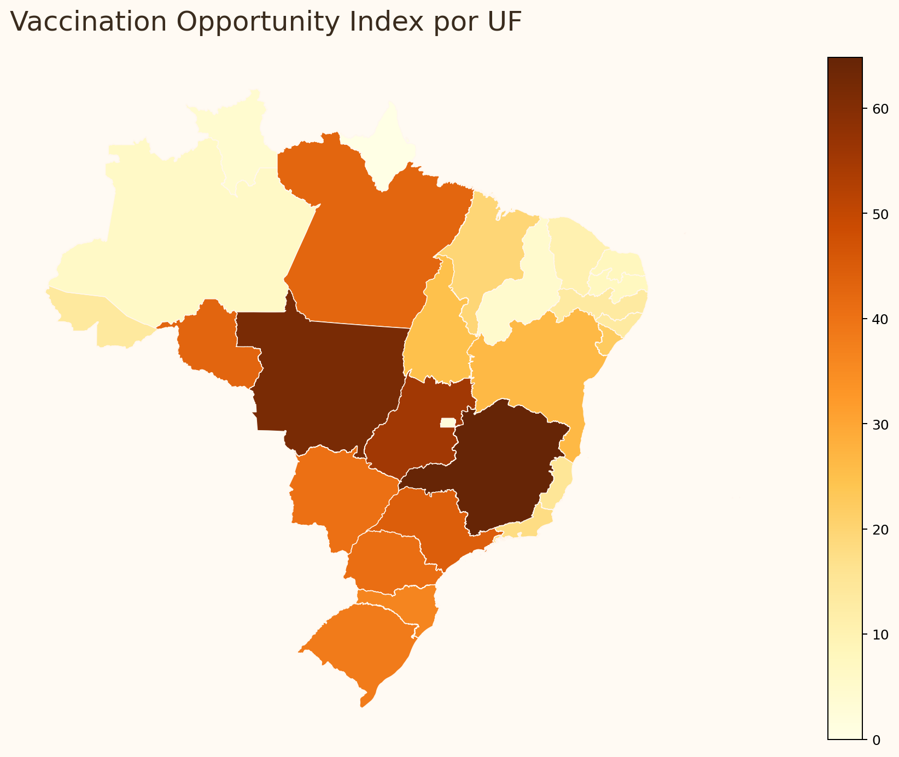
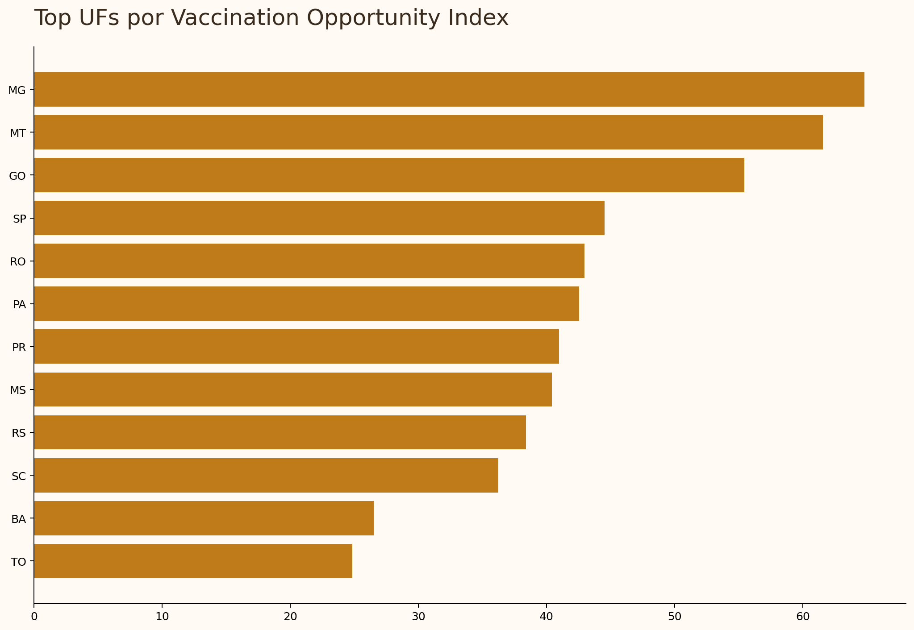
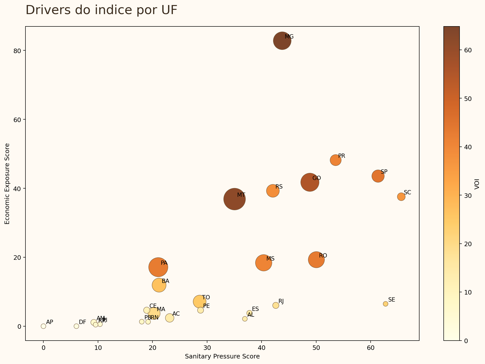
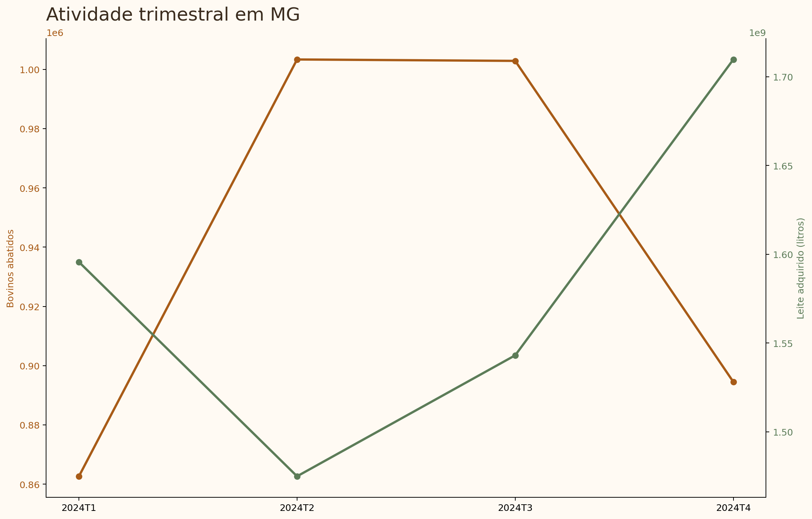

# VaxIntel Brasil


VaxIntel Brasil e uma plataforma de inteligencia territorial para priorizacao estrategica de vacinacao animal no Brasil. O MVP atual foca em bovinos, no nivel de UF, e combina exposicao animal, proxies transparentes de pressao sanitaria indireta e exposicao economica com base exclusivamente em dados reais e fontes primarias oficiais.

O projeto foi desenhado para parecer um produto analitico plausivel em `animal health`, vacinas veterinarias e inteligencia de mercado agro. Ele nao estima cobertura vacinal real, nao mede eficacia de vacina e nao faz afirmacoes causais sobre resultado economico.

## Executive Summary

A pergunta central do projeto e objetiva: quais UFs brasileiras concentram maior oportunidade estrategica para programas de vacinacao em bovinos quando combinamos tamanho do rebanho, intensidade produtiva, proxies de pressao sanitaria e valor economico exposto?

Para responder isso, o MVP organiza dados oficiais do IBGE em tres scores:

- `Animal Exposure Score`
- `Sanitary Pressure Score`
- `Economic Exposure Score`

Esses blocos alimentam um indice composto configuravel:

```text
Vaccination Opportunity Index
= w_animal * Animal Exposure Score
+ w_sanitary * Sanitary Pressure Score
+ w_economic * Economic Exposure Score
```

Pesos default do MVP:

- `w_animal = 0.40`
- `w_sanitary = 0.30`
- `w_economic = 0.30`

## Dashboard









## Why This Matters For Animal Health

Em saude animal, a decisao de onde concentrar esforco comercial, tecnico e sanitario raramente depende de uma unica metrica. Territorios com grande rebanho, alta intensidade produtiva e maior valor economico exposto tendem a exigir maior precisao de priorizacao.

O `VaxIntel Brasil` transforma dados publicos dispersos em uma camada auditavel de inteligencia territorial. Em vez de depender apenas de intuicao comercial ou leitura isolada de mercado, o projeto organiza uma tese de oportunidade territorial com metodologia explicita e reproduzivel.

## Business Applications

- priorizacao geografica de programas preventivos e vacinais
- planejamento comercial por territorio
- suporte a go-to-market regional em animal health
- calibragem de campanhas tecnicas com base em relevancia produtiva
- inteligencia executiva para liderancas comerciais, tecnicas e de mercado

## Real Data Used In The MVP

O recorte atual usa 2024 como ano-base harmonizado e integra:

- IBGE SIDRA / PPM tabela 3939 para efetivo bovino por UF
- IBGE tabela 1092 para abate bovino trimestral e peso de carcacas por UF
- IBGE tabela 1086 para leite adquirido e preco medio por UF
- IBGE Geociencias `BR_UF_2024.zip` para geometrias e area das UFs

As URLs operacionais exatas, anos de referencia e datas de extracao estao em [docs/data_sources.md](docs/data_sources.md).

## Repository Tour

- [docs/methodology.md](docs/methodology.md): formula dos scores, pesos, regras de normalizacao e limites de inferencia
- [docs/data_sources.md](docs/data_sources.md): fontes, URLs operacionais, ano-base e rastreabilidade
- [docs/data_dictionary.md](docs/data_dictionary.md): definicao das colunas do dataset processado e da base trimestral
- [app/main.py](app/main.py): dashboard Streamlit
- [scripts/download_data.py](scripts/download_data.py): ingestao real de dados oficiais
- [scripts/build_dataset.py](scripts/build_dataset.py): construcao do dataset final e do indice composto

## Run Locally

```bash
python -m venv .venv
source .venv/bin/activate
pip install -r requirements.txt
python scripts/download_data.py
python scripts/build_dataset.py
python scripts/run_app.py
```

Principais artefatos gerados:

- `data/processed/vaxintel_bovinos_uf.parquet`
- `data/processed/bovines_quarterly_uf.parquet`
- `data/processed/brazil_ufs.geojson`
- `data/processed/source_manifest.csv`

## Analytical Limitations

- o bloco sanitario usa proxies indiretas e nao vigilancia laboratorial causal
- o indice nao mede cobertura vacinal real
- o indice nao mede eficacia de vacina
- o indice nao deve ser interpretado como probabilidade de surto
- o bloco economico do MVP ainda e parcial, com sinal monetario mais forte na frente leiteira
- resultados trimestrais do IBGE podem estar preliminares dependendo da data de extracao

## Roadmap

- ampliar a camada economica com indicadores adicionais do CEPEA
- incorporar proxies sanitarias oficiais mais amplas via MAPA
- expandir a arquitetura para aves, suinos e aquacultura
- evoluir de UF para recortes territoriais mais finos quando a qualidade dos dados justificar

## Author

Mateus Martins  
Medico Veterinario | Data Analyst
