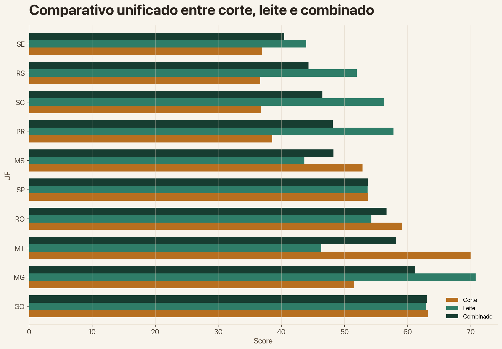
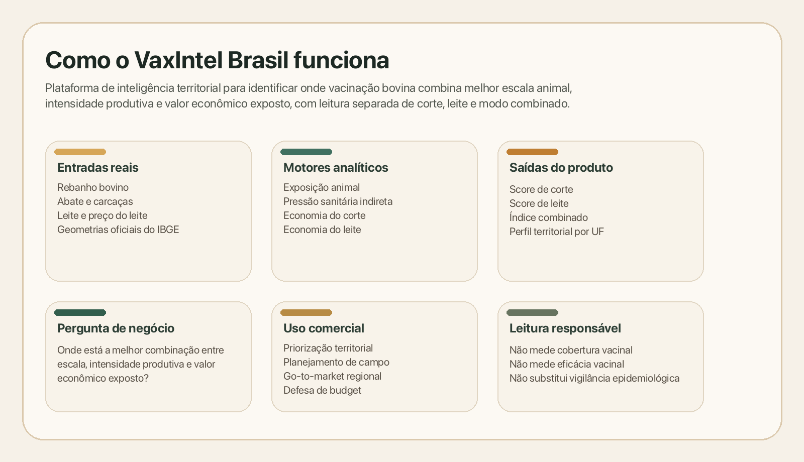
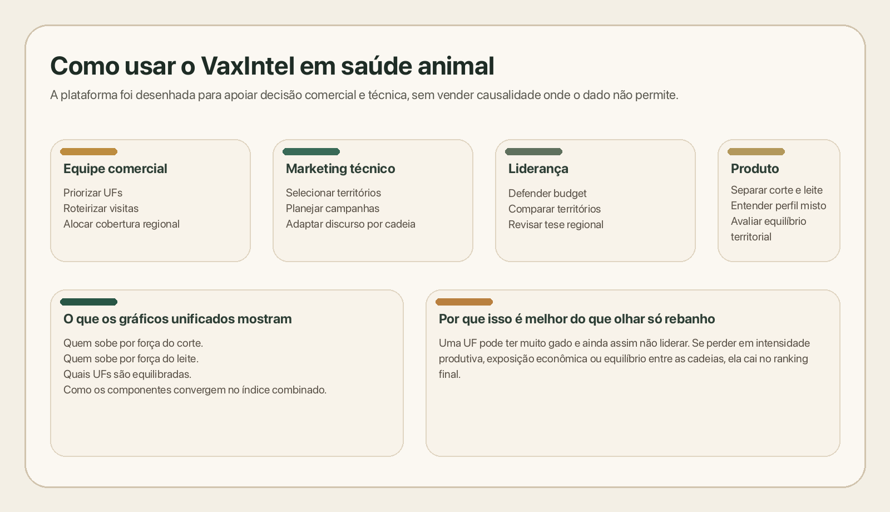

# VaxIntel Brasil


O VaxIntel Brasil é uma plataforma de inteligência territorial para priorização estratégica de programas de vacinação animal no Brasil. A versão atual foca em bovinos, no nível de UF, e separa explicitamente os motores de leitura de **gado de corte**, **gado de leite** e **visão combinada**, usando apenas dados reais e fontes primárias oficiais.

Na prática, o projeto tenta responder uma pergunta simples: onde faz mais sentido olhar com atenção quando a decisão envolve vacinação bovina, escala produtiva e valor econômico exposto. Ele não estima cobertura vacinal real, não mede eficácia de vacina e não faz afirmações causais sobre desfechos econômicos.

## Visão executiva

A pergunta central do projeto é: quais UFs brasileiras concentram maior oportunidade estratégica para programas de vacinação em bovinos quando combinamos tamanho do rebanho, intensidade produtiva, proxies de pressão sanitária e valor econômico exposto?

Para responder isso, a v2 organiza os dados em quatro blocos:

- `Animal Exposure Score`
- `Sanitary Pressure Score`
- `Beef Economic Score`
- `Dairy Economic Score`

Esses blocos alimentam três leituras:

- `Beef Opportunity Score`
- `Dairy Opportunity Score`
- `Combined Vaccination Opportunity Index`

Estrutura resumida:

```text
Beef Opportunity Score
= w_animal_beef * Animal Exposure Score
+ w_sanitary_beef * Sanitary Pressure Score
+ w_beef_economic * Beef Economic Score

Dairy Opportunity Score
= w_animal_dairy * Animal Exposure Score
+ w_sanitary_dairy * Sanitary Pressure Score
+ w_dairy_economic * Dairy Economic Score

Combined Vaccination Opportunity Index
= w_beef * Beef Opportunity Score
+ w_dairy * Dairy Opportunity Score
```

Pesos padrão:

- `Corte = 0,40 animal + 0,30 sanitário + 0,30 econômico`
- `Leite = 0,35 animal + 0,25 sanitário + 0,40 econômico`
- `Combinado = 0,50 corte + 0,50 leite`

Os pesos são configuráveis por ambiente e estão documentados em [`.env.example`](.env.example) e [`src/vaxintel/config.py`](src/vaxintel/config.py).

## Resultados do recorte atual

No cenário-padrão da v2, com pesos balanceados entre corte e leite, as cinco UFs com maior **Índice Combinado de Oportunidade Vacinal** são:

| Posição | UF | VOI |
|---|---|---:|
| 1 | GO | 63,1 |
| 2 | MG | 61,1 |
| 3 | MT | 58,1 |
| 4 | RO | 56,6 |
| 5 | SP | 53,7 |

Algumas leituras rápidas:

- **Goiás** lidera o combinado porque aparece forte nas duas frentes, sem depender só de corte ou só de leite.
- **Minas Gerais** continua muito forte pela frente leiteira, mas não sobe apenas por isso.
- **Mato Grosso** segue entre os líderes por escala animal e força relativa do corte.

## Dashboard

O dashboard foi organizado em cinco abas:

- `Visão executiva`
- `Drivers por UF`
- `Evolução temporal`
- `Base analítica`
- `Metodologia`




## Visão do projeto em imagens

Além das telas do dashboard, deixei duas imagens curtas para mostrar a estrutura do projeto e como ele pode ser usado em contexto comercial.





## Por que isso importa em saúde animal

Em saúde animal, priorização territorial raramente depende de uma métrica só. Um estado pode ter muito rebanho e, ainda assim, não ser o melhor território quando se olha intensidade produtiva, exposição econômica e equilíbrio entre corte e leite.

O VaxIntel Brasil organiza dados públicos dispersos em uma leitura territorial mais útil para decisão. A proposta não é responder apenas onde há mais boi, mas onde a combinação entre escala, intensidade e valor exposto sugere maior relevância estratégica.

## Aplicações de negócio

- Priorização geográfica de programas preventivos e vacinais.
- Planejamento comercial por território.
- Suporte a estratégias regionais de go-to-market em animal health.
- Planejamento de campanhas técnicas com base em relevância produtiva.
- Inteligência executiva para lideranças comerciais, técnicas e de mercado.
- Segmentação entre territórios mais orientados a corte, leite ou perfil misto.
- Defesa de budget comercial e técnico com racional analítico auditável.

## Dados reais utilizados na v2

O recorte atual usa 2024 como ano-base harmonizado e integra:

- IBGE SIDRA / PPM tabela 3939 para efetivo bovino por UF.
- IBGE tabela 1092 para abate bovino trimestral e peso de carcaças por UF.
- IBGE tabela 1086 para leite adquirido e preço médio por UF.
- IBGE Geociências `BR_UF_2024.zip` para geometrias e área das UFs.

As URLs operacionais, os anos de referência e as datas de extração estão documentados em [docs/data_sources.md](docs/data_sources.md).

### Por que o ano-base é 2024

O projeto adota **2024** como padrão porque esse é o corte anual mais consistente para harmonizar as três fontes quantitativas centrais:

- Rebanho bovino da PPM com disponibilidade fechada para 2024.
- Consolidação dos quatro trimestres de 2024 para abate bovino.
- Consolidação dos quatro trimestres de 2024 para leite e preço médio do leite.

Como ponto de entrega em **1º de abril de 2026**, esse recorte é mais conservador do que misturar séries de anos diferentes ou usar bases ainda mais sujeitas a revisão. O pipeline já está preparado para trocar o ano de referência via variável `VAXINTEL_REFERENCE_YEAR` quando as séries equivalentes estiverem disponíveis.

## Tour do repositório

- [docs/methodology.md](docs/methodology.md): Fórmulas dos scores, pesos, regras de normalização, limites de inferência e racional da separação entre corte e leite.
- [docs/data_sources.md](docs/data_sources.md): Fontes, URLs operacionais, ano-base e rastreabilidade.
- [docs/data_dictionary.md](docs/data_dictionary.md): Definição das colunas do dataset processado e da base trimestral.
- [app/main.py](app/main.py): Dashboard Streamlit.
- [scripts/download_data.py](scripts/download_data.py): Ingestão real de dados oficiais.
- [scripts/build_dataset.py](scripts/build_dataset.py): Construção do dataset final e dos scores de corte, leite e combinado.

## Como executar localmente

```bash
python -m venv .venv
source .venv/bin/activate
pip install -r requirements.txt
python scripts/download_data.py
python scripts/build_dataset.py
python scripts/run_app.py
```

Principais artefatos gerados:

- `data/processed/vaxintel_bovinos_uf.parquet`
- `data/processed/bovines_quarterly_uf.parquet`
- `data/processed/brazil_ufs.geojson`
- `data/processed/source_manifest.csv`

## O que o índice mede

- Escala relativa da exposição animal por UF.
- Pressão sanitária indireta baseada em proxies produtivas transparentes.
- Exposição econômica relativa da cadeia bovina de corte.
- Exposição econômica relativa da cadeia bovina de leite.
- Prioridade territorial para programas preventivos e vacinais em três modos de leitura: corte, leite e combinado.

### Como interpretar o bloco sanitário

O **Sanitary Pressure Score** não representa incidência confirmada de doença nem vigilância laboratorial oficial. Aqui ele funciona como uma **proxy de intensidade territorial**, combinando:

- densidade bovina por território
- intensidade de abate em relação ao rebanho
- intensidade leiteira em relação ao rebanho

Em termos simples, ele sinaliza onde a operação bovina é mais intensa e, portanto, potencialmente mais sensível do ponto de vista preventivo e sanitário. É uma métrica de priorização, não uma medida causal de risco epidemiológico.

### Por que o ranking não é só rebanho

O ranking final não é um ranking de tamanho de rebanho. Uma UF pode ter grande massa animal e ainda assim não liderar se:

- perder em intensidade produtiva relativa
- perder em exposição econômica observável
- concentrar força apenas em corte ou apenas em leite
- ter menor equilíbrio entre os motores quando o modo combinado é usado

Essa distinção é importante para o uso comercial do projeto. O objetivo não é identificar apenas onde há mais bovinos, mas onde a combinação entre escala, intensidade e valor exposto sustenta uma oportunidade territorial mais forte.

## O que o índice não mede

- Cobertura vacinal observada.
- Eficácia de vacina.
- Probabilidade causal de surto.
- Impacto econômico causal de uma intervenção específica.

## Limitações analíticas

- O bloco sanitário usa proxies indiretas e não vigilância laboratorial causal.
- O índice não mede cobertura vacinal real.
- O índice não mede eficácia de vacina.
- O índice não deve ser interpretado como probabilidade de surto.
- O bloco econômico da cadeia de corte ainda é mais forte em proxies físicas de escala do que em valor monetário direto.
- Resultados trimestrais do IBGE podem estar preliminares dependendo da data de extração.

## Roadmap

- Publicar uma demo online do dashboard para navegação pública.
- Adicionar badges e visibilidade do CI no README.
- Ampliar a camada econômica com indicadores adicionais do CEPEA.
- Incorporar proxies sanitárias oficiais mais amplas via MAPA.
- Expandir a arquitetura para aves, suínos e aquacultura.
- Evoluir de UF para recortes territoriais mais finos quando a qualidade dos dados justificar.

## Autor

Mateus Martins  
Médico Veterinário | Data Analyst
